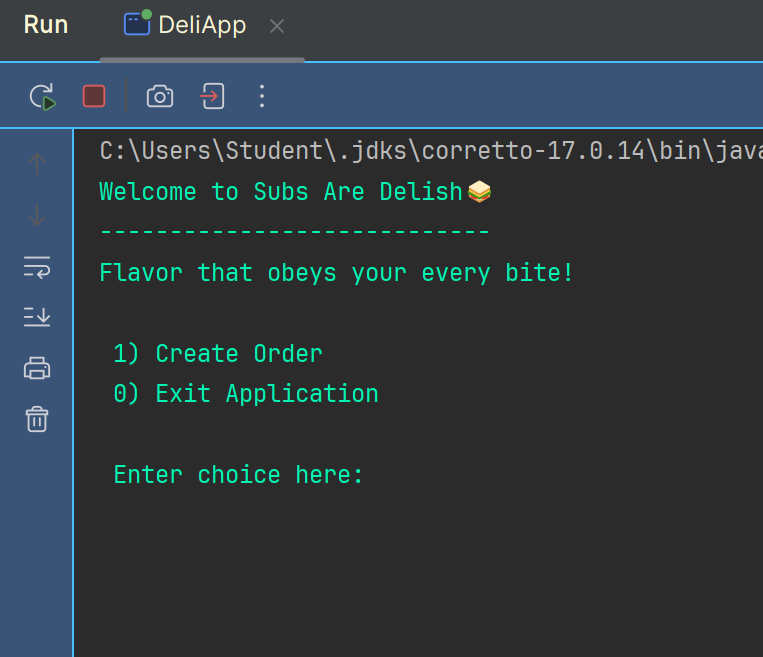
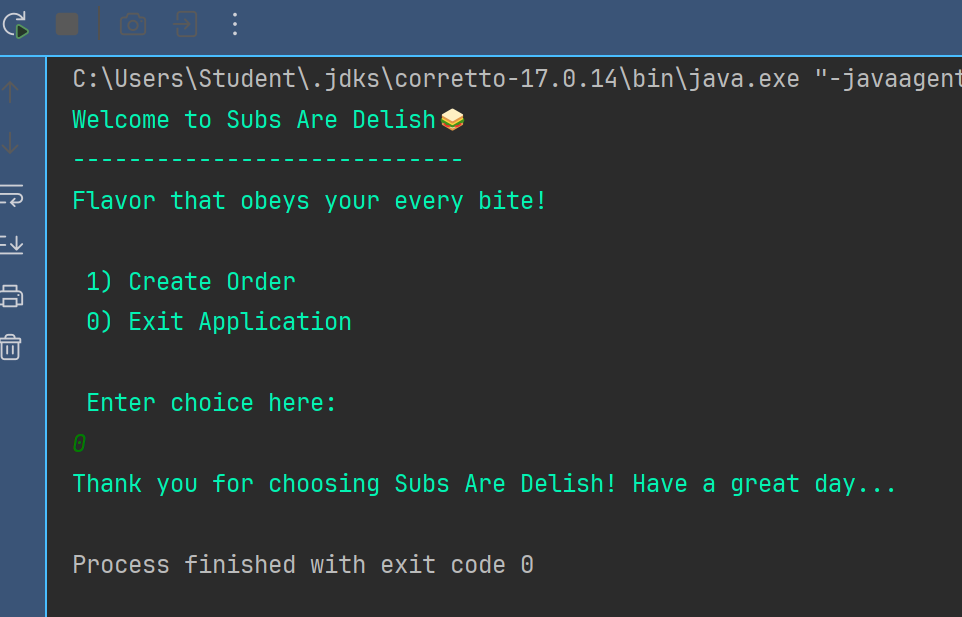
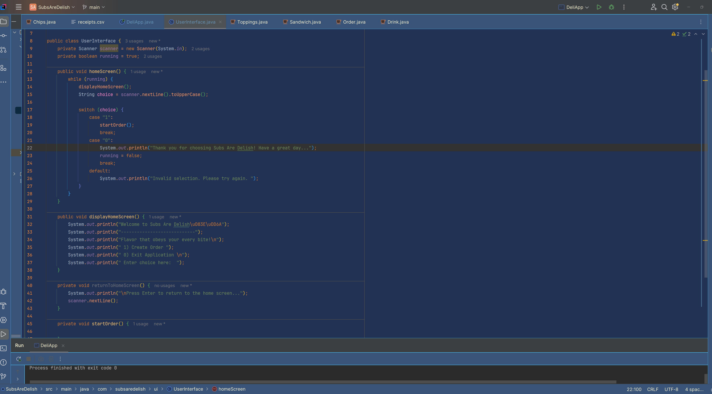
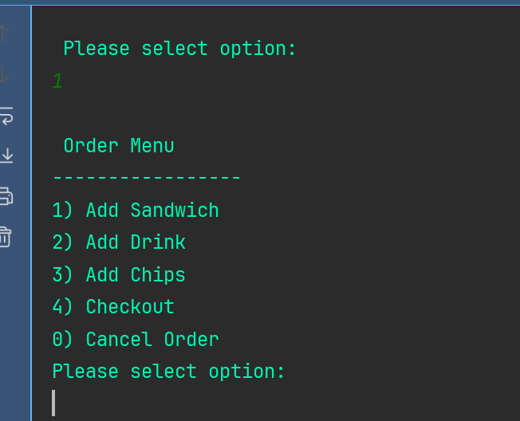
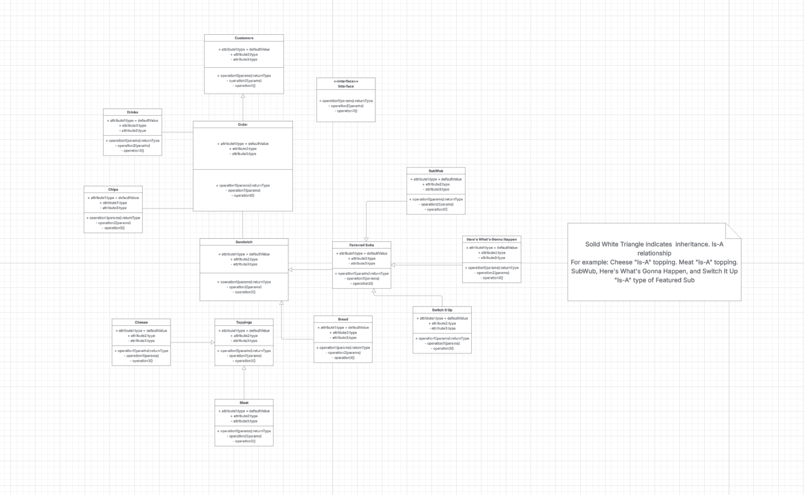
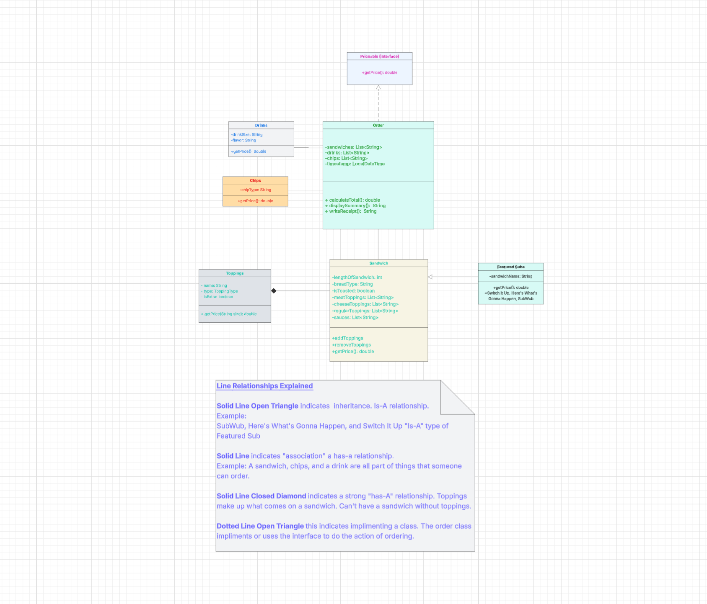
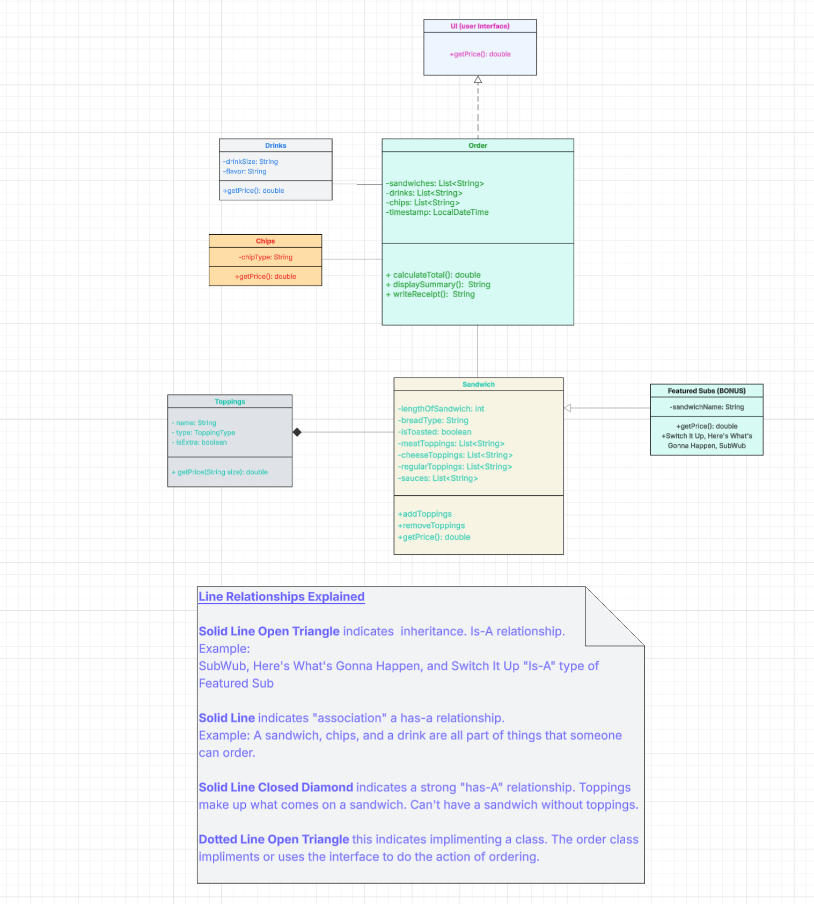
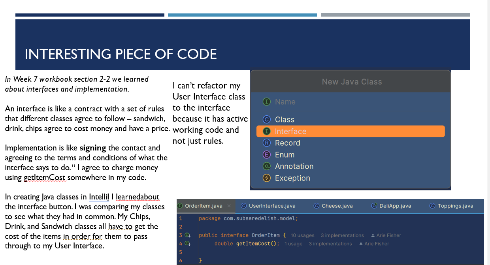

#  Subs Are Delish Capstone-2

Welcome to Subs Are Delish — Flavor that obeys your every bite!

---
## Project Description

Purpose of Assignment: Create a P.O.S (Point Of Sales) custom sandwich shop where the customer can create a sandwich with the functionality to make a combo meal with drink and chip options resulting in a receipt of purchase. 

### Features:
- Create a custom sandwich with bread, size, meat, cheese, and toppings
- Add chips and drinks
- Total cost is calculated using " getItemCost(): "
- User receives a receipt 
- Receipt is saved to a .txt file with a timestamp
- Option to cancel an order before checkout
- Uses interfaces for shared item pricing

---

## Application Screens

## Screenshots

### Home Screen

### Order Menu

### UML Diagram

---

## Interesting Code To Share

